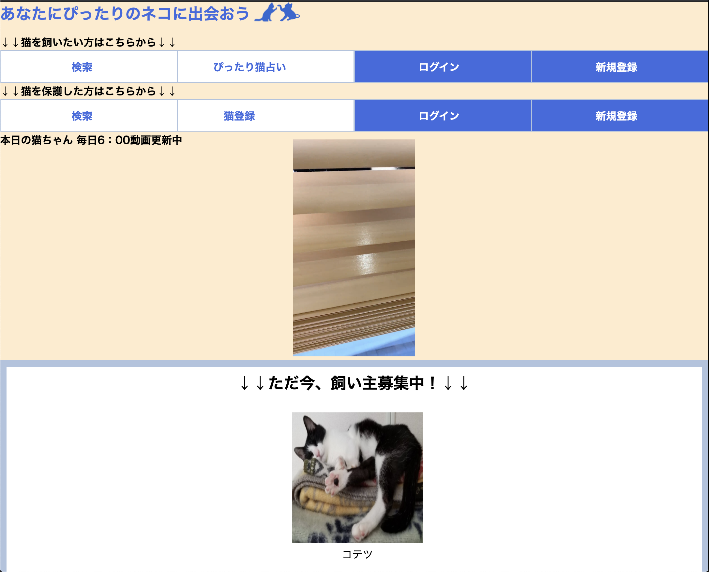

# README
   

## アプリの名前
  あなたにぴったりのネコに出会おう

## URL 
  https://www.neko-matching-service.com/

## 利用方法
- 保護猫(cat)と猫を飼いたい人(personal)のマッチングアプリです。
- 保護団体や、個人(trader)が保護猫を登録して、会員登録した猫(cat)を飼いたい人(personal)が飼育決定した時、マッチング成功です。
- 飼育決定者は寄付という形で任意でクレジット決済が出来ます。
- 相性診断をする事で、マッチ度向上を目指します。

## 目指した課題解決
  ### ペルソナ
  - 猫を飼いたい人
  - 猫が飼えるか不安のある人
  - 占い好きな人
  - 猫の動画、画像で癒されたい人
  - 20から50代

  ### ペルソナの課題
  | 課題                       | 解決策                |
  | --------------------------| ---------------------|
  | 猫を飼いたいが飼えるか不安     |   占い形式で判断させる  |
  | かわいい猫を飼いたい          |   たくさんの猫から選ぶ  |
  | 動画で癒されたい             |   トップに表示の毎日更新される動画を見れる  |

  ### 課題を解決したいと感じた背景、意図
  - 動物業界に携わっていたものとして、何らかの形で動物と人との共存の一役をを担える活動がしたい
  - 海外の先進国に比べ、日本は動物愛護が遅れていて、未だに保健所では殺処分が行われている現実を改善したい
  - 動物を飼いたいと思った時、ペットショップへ行くだけでなく、保護動物を受け入れるという選択肢が同様に考えとして挙がるような雰囲気作りがしたい
  - 猫を飼いたいと思ったら、検索ワードで「かわいい、人気、ネコ」と打つと想定。保護猫サイトはヒットせず、わざわざ保護猫を受け入れようとした人以外は保護猫サイトに訪れない。
  - かわいい猫を見るためだけに保護猫サイトを訪れて次第にその猫のファンになって行くという構図があっても良いのではないか。
  - 現在ある保護猫サイトは倫理観強めである事が多い。

## 洗い出した要件
| 優先順位（高：3、中：2、低：1）| 機能             | 目的                                | 詳細                                                | ストーリー(ユースケース)                            |見積もり（所要時間）       |
|  :------------------------:|------------------|------------------------------------|----------------------------------------------------|----------------------------------------------------------|:------------:| 
| 3                         | 一覧表示          | catが一気に見れる	                    | 一覧、トップページでそれぞれ表示                        | トップページで一覧表示	                                      | 24            |
| 3                         | 詳細表示          | 気に入ったcatの情報詳細	               | 詳細、個体の詳細	                                    | トップページから詳細ページ、占い結果一覧から詳細ページ	            | 12            |
| 3                         | 会員登録          | personal登録	                      | deviseでのユーザー管理                                | ユーザー登録はお気に入りボタンからもしくは直接会員登録ページから     | 12            |
| 1                         | お気に入り登録     | cat飼育決定前に保留	                 | sessionを使用                                       | 詳細ページからお気に入りを登録できる                             | 24           |
| 3                         | 猫登録	          | traderがcat情報を登録	               | 個体の登録                                           | 業者登録後、猫登録                                            | 12           |
| 2                         | 猫飼育決定         | personalが飼育決定しtraderと連絡をとる | 飼育決定、寄付機能                                    | 詳細ページから飼育決定ページ（寄付あり）                         | 24            |
| 1                         | 検索（占い方式)     | 飼育したいcatを条件で探すため          | タグを用いた検索、session使用、マッチ度％出す、pjaxで猫占い| トップページから占いへ進む                                     | 48            |
| 1                         | マイページ         | お気に入りcat表示                    | マイページ詳細、登録内容表示、お気に入り猫表示             |会員詳細ページに会員情報、お気に入り猫表示                         | 12            |
| 3                         | 猫登録業者マイページ | traderの管理と登録catが一覧表示       | 登録業者のみ猫登録                                     | 業者登録した後、マイページから猫登録                            | 24            |
| 3                         | 猫編集            | catに修正があった時に編集              | 個体詳細から編集                                      | 個体を登録した業者のみ個体詳細ページから編集ボタンで編集            | 24            |
| 3                         | 猫削除            | catが引き取られ済の場合削除            | 個体詳細から削除                                       | 個体を登録した業者のみ個体詳細ページから削除ボタンで削除           | 12            |

## 実装した機能
- 一覧表示
- 詳細表示
- 会員登録
- 猫登録
- 猫飼育決定
- マイページ
- 猫登録業者マイページ
- 猫編集
- 猫削除

## 実装予定の機能
- お気に入り登録
- 検索（占い方式)

## テスト用アカウント等
  ### ID/Pass
  | Basic認証ID   |  Basic認証Pass    |
  | ------------ | ----------------- |
  |   admin      |   2222            |
  ### 飼育決定者用
  | メールアドレス   |  パスワード       |
  | -------------- | --------------- |
  |   yyyy@yyyy    |     67yyyyyy    |
  ### 飼育決定者用カード情報
  | 番号              | 期限                   | セキュリティコード        |
  |  --------------- | ---------------------- | ---------------------- |
  | 4242424242424242 |       12/24            |     123                |
  ### 猫登録業者用
  | メールアドレス名    |   パスワード              |
  | ---------------- | ------------------------ |
  |  uuuu@uuuu       |     67uuuuuu             |

# テーブル設計
### ER図
https://gyazo.com/2a6e95675ddf3377bc835ec6e9bf2f22

## users テーブル
| Column           | Type       | Option                   |
| ---------------- | ---------- | ------------------------ |
| nickname         | string     | null: false              |
### Association
- has_one :personal

##  traders テーブル
| Column           | Type       | Option                                 |
| ---------------- | ---------- | -------------------------------------- |
| email            | string     | null: false                            |
| password         | string     | null: false                            |
| t_name           | string     | null: false                            |
| t_postal_code    | string     | null: false                            |
| area_id          | integer    | null: false                            |
| t_city           | string     | null: false                            |
| t_address_num    | string     | null: false                            |
| t_building_num   | string     |                                        |
| t_tel            | string     | null: false                            |
### Association
- has_many :families, dependent: :destroy
- has_many :cats, dependent: :destroy
- belongs_to_active_hash :area

##  personals テーブル
| Column           | Type       | Option                        |
| ---------------- | ---------- | ----------------------------- |
| email            | string     | null: false                   |
| password         | string     | null: false                   |
| user             | references | null: false, forein_key: true |
### Association
- has_many :favorites
- has_many :families
- belongs_to :user

##  addresses テーブル
| Column           | Type       | Option                                 |
| ---------------- | ---------- | -------------------------------------- |
| postal_code      | string     | null: false                            |
| area_id          | integer    | null: false                            |
| city             | string     | null: false                            |
| address_num      | string     | null: false                            |
| building_num     | string     |                                        |
| tel              | string     | null: false                            |
| first_name       | string     | null: false                            |
| last_name        | string     | null: false                            |
| first_pkey       | string     | null: false                            |
| last_pkey        | string     | null: false                            |
| family           | references | null: false, forein_key: true          |
### Association
- belongs_to :family
- belongs_to_active_hash :area

##  cats テーブル
| Column              | Type       | Option                                 |
| ------------------- | ---------- | -------------------------------------- |
| images              | string     | null: false                            |
| c_name              | string     | null: false                            |
| c_text              | text       | null: false                            |
| breed_id            | integer    |                                        |
| ope_id              | integer    | null: false                            |
| sex_id              | integer    | null: false                            |
| age_id              | integer    | null: false                            |
| hair_length_id      | integer    |                                        |
| color_id            | integer    |                                        |
| how_many_id         | integer    |                                        |
| eye_color_id        | integer    |                                        |
| character_id        | integer    | null: false                            |
| fleas_id            | integer    | null: false                            |
| veccine_id          | integer    | null: false                            |
| kuchu_id            | integer    | null: false                            |
| single_id           | integer    |                                        |
| sinior_id           | integer    |                                        |
| price               | integer    |                                        |
| trader              | references | null: false, forein_key: true          |
### Association
- belongs_to :trader
- has_one :family, dependent: :destroy
- has_many_attached :images
- has_one :favorite
- belongs_to_active_hash :breed
- belongs_to_active_hash :ope
- belongs_to_active_hash :sex
- belongs_to_active_hash :age
- belongs_to_active_hash :hair_length
- belongs_to_active_hash :color
- belongs_to_active_hash :how_many
- belongs_to_active_hash :eye_color
- belongs_to_active_hash :character
- belongs_to_active_hash :fleas
- belongs_to_active_hash :veccine
- belongs_to_active_hash :kuchu
- belongs_to_active_hash :single
- belongs_to_active_hash :senior

##  families テーブル
| Column              | Type       | Option                                 |
| ------------------- | ---------- | -------------------------------------- |
| donation            | string     | null: false                            |
| message             | string     | null: false                            |
| cat                 | references | null: false, forein_key: true          |
| personal            | references | null: false, forein_key: true          |
| trader              | references | null: false, forein_key: true          |
### Association
- belongs_to :cat
- belongs_to :personal
- belongs_to :trader
- has_one :address, dependent: :destroy

##  favorites テーブル
| Column           | Type       | Option                               |
| ---------------- | ---------- | ------------------------------------ |
| cat              | references | null: false, forein_key: true        |
| personal         | references | null: false, forein_key: true        |
### Association
- belongs_to :cat
- belongs_to :personal